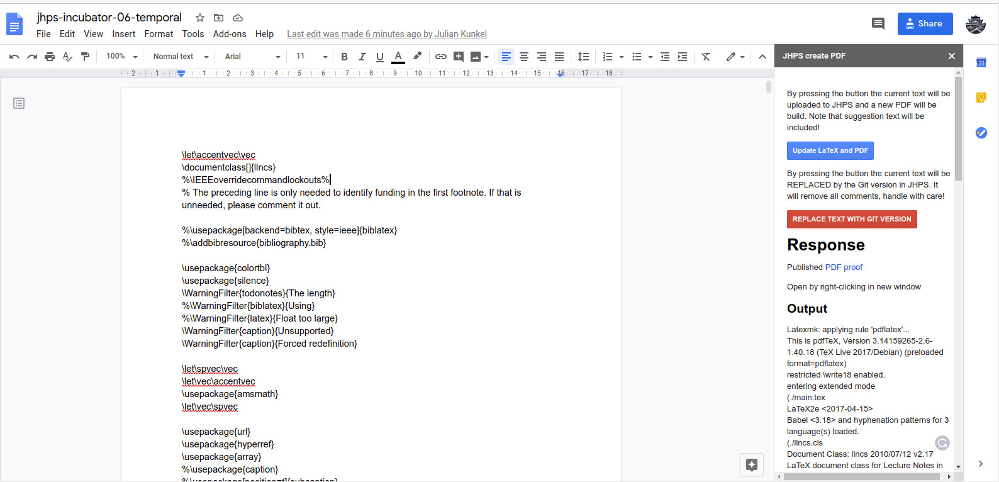

# JHPS LaTeX template

This LaTeX template is part of the Journal of High-Performance [description for authors](https://jhps.vi4io.org/authors/).

## Submission to the Incubator: Workflow

The workflow utilizes combination of GoogleDoc, LaTeX and Git/GitHub to ensure reliable, easy content creation, public reviews, simple merging, and flexibility.

  1. Please prepare your document according to the LaTeX template (see [main.tex](main.tex)).
  2. Submit the information about the repository to the journal see [for authors](https://jhps.vi4io.org/authors/).
  3. Once the paper is accepted to the incubator, an ID is given. The ID will be *jhps-incubator-&lt;month of submission&gt;-&lt;title-excerpt&gt;*.
    The repository it will be cloned into GitHub of the VI4IO with ID as a name, e.g., like [this paper](https://github.com/VI4IO/jhps-incubator-06-temporal). At this stage, the following documents are created:
     - A Google Doc containing the manuscript ([main.tex](main.tex)) allowing for commenting by reviewers. The Google Doc will include the JHPS plugin allowing synchronization with Git and republishing of the paper.
     - The initial PDF version (&lt;ID&gt;.pdf) of the manuscript is created and publicly shared under the URL: https://jhps.vi4io.org/pdf/&lt;PDF&gt;
     - The repository and Google Doc is shared with the corresponding authors.

## Workflow for Review and Feedback Phase

  1. A reviewer can view the PDF and ask for "comment" permissions in Google Doc, and then make comments or suggestions directly in the LaTeX Google Doc. Typically, the author (or editorial board) will grant **review permission** for any reviewer.
  2. The author shall incorporate the feedback and whenever it suits release a new version of the PDF + trigger the commit to the repository. Note that for a release, all currently pending comments must be incorporated as Google API doesn't allow to identify which text is suggested and suggested text is always included. Comments can remain and are preserved for a submission.
  3. During review and feedback phase, the authors can push any update to the Git repository but shall not  make an update to [main.tex](main.tex) though via Git any more as someone may add suggestions to the current Google Doc.

### Creating a new version PDF

Synchronization between Google Doc and Git/LaTeX generated PDF is an activity that is done by an author.
The author can click on "Add-ons" =&gt; "JHPS LaTeX" to open a side panel (see the figure)
)
Accept the permissions for the plugin within Google Doc, the permissions will only be active for this particular document.
With this side panel, the author can trigger the PDF creation on the JHPS server and update the Google Doc directly from the Git repository.
Note that a "pull" will remove all comments, therefore, it shall only be applied *after all suggestions/comments by reviewer has been applied*.
The side panel cannot be used by anyone except someone that has "edit" permissions to the document.

Updates of figures and other assets in the repository do not interfere with the GoogleDoc replication of main.tex and can always be made.
Whenever one of the buttons is clicked, the remote repo is pulled and merged with the current Google Doc version.

## Structure of this repository

  - [main.tex](main.tex): this file shall contain all text of the full paper.
  - [bibliography.bib](bibliography.bib): this file contains the BibTex of the paper.
  - [assets](assets): include all figures and material referenced by LaTeX.
  - [workflow](workflow): a directory containing the workflow for the reproducible workflow.
  - [main.pdf](main.pdf): after you run LaTeX, it shall contain the created PDF, do not check this file into the repository!

## Get started

To get started clone this repository.
To test the correct behavior build the LaTeX using __pdflatex main.tex__ or __latexmk -pdf main.tex__.
